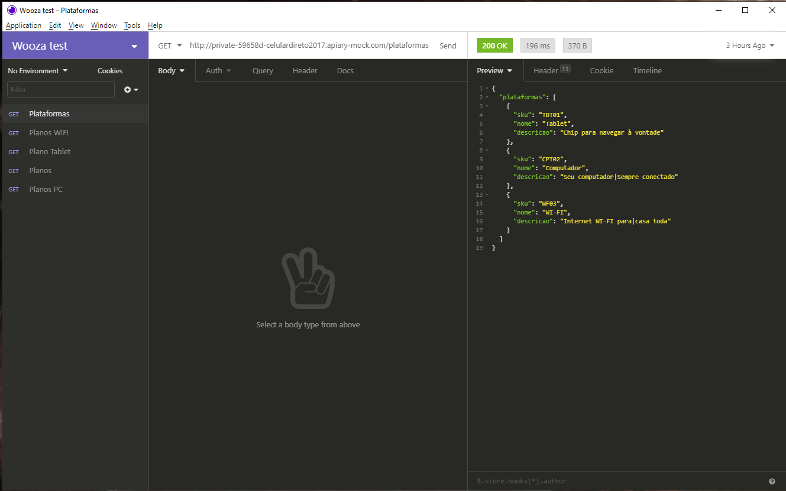
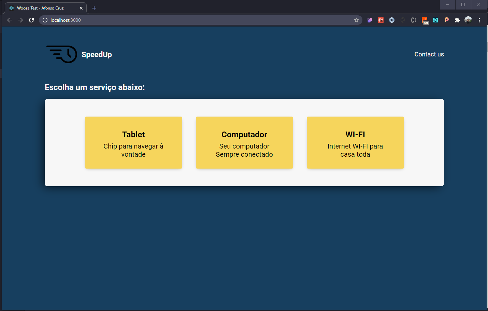
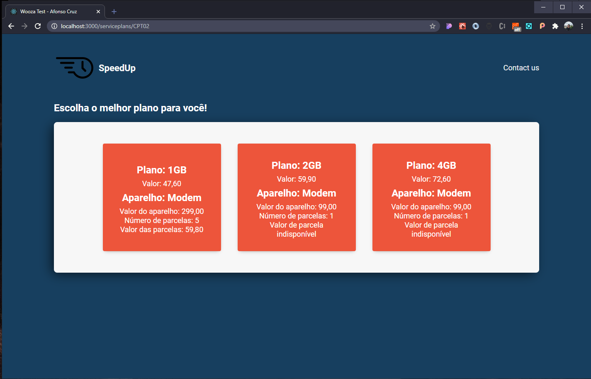
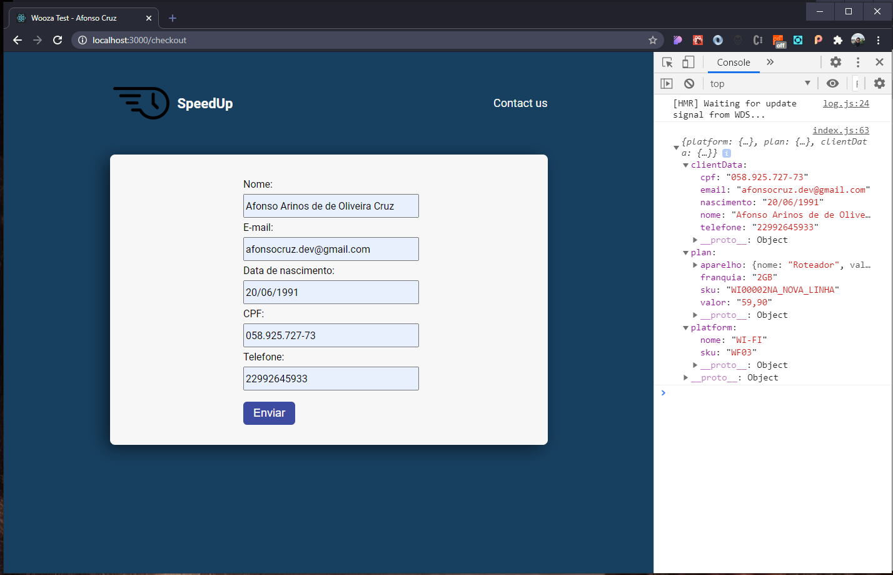

# Front end wooza test

### Simple app to persist data on page changing, at the end rendering all the data on the console.

### Created with:

# Get Started

### SpeedUp App requires [Node.js](https://nodejs.org/) to run.

- verify if there's `yarn` or `npm` installed on your computer.
- clone this repository and run `npm install` or `yarn` to install all the dependencies.
- [Yarn Download](https://yarnpkg.com/)
- after downloading all dependencies, acess the project folder and run `yarn start` or `npm start` then go to http://localhost:3000.

## Production Version / Deployed

[SpeedUp](https://wooza-frontend-test-afonso-cruz.vercel.app/)

### Tutorials and Documentations

- [Redux Documentation](https://redux.js.org/);
- [Redux Rocketseat Tutorial](https://www.youtube.com/watch?v=7L7MhxjI4PE&t=3s);
- [React Documentation](https://pt-br.reactjs.org/);

### Project Screens

Listing endpoints

Listing platforms

Listing plans

Listing form and response from console

### Notes

I'd like to thank Wooza for this opportunity to face this challenge, my programming background was not easy because I risked everything to become a programmer. Now I see I'm improving a lot, so, even if I do not be chosen by you, I really appreciated the test, it has blown my mind working with redux, such a tool I was learning before. I'd like to thank Mariana Barata for being a receptive person through my recruitment in here. That's all guys, hope you enjoy! :)

## License

MIT

[node.js]: http://nodejs.org
[yarn]: https://yarnpkg.com/
